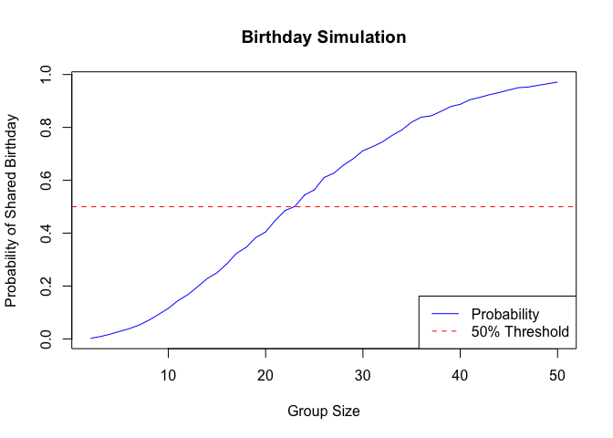

p8105_hw5_xg2451
================

## Problem 1

``` r
# Function to check for duplicate birthdays
has_duplicates <- function(n) {
  birthdays <- sample(1:365, n, replace = TRUE)
  return(any(duplicated(birthdays)))
}

# Parameters
group_sizes <- 2:50
n_simulations <- 10000
probs <- numeric(length(group_sizes))

# Run simulations for each group size
for (i in seq_along(group_sizes)) {
  n <- group_sizes[i]
  results <- replicate(n_simulations, has_duplicates(n))
  probs[i] <- mean(results)
}

# Plot 
plot(group_sizes, probs, type = "l", col = "blue",
     xlab = "Group Size",
     ylab = "Probability of Shared Birthday",
     main = "Birthday Simulation")
abline(h = 0.5, col = "red", lty = 2)
legend("bottomright", legend = c("Probability", "50% Threshold"),
       col = c("blue", "red"), lty = c(1, 2))
```

<!-- -->

**Comment:**

The plot illustrates how the probability that at least two people share
a birthday increases with the group size. Notably, around a group size
of 23, the probability crosses the 50% threshold. As the group size
approaches 50, the probability nears 100%, indicating that it becomes
almost certain for a duplicate birthday to occur in larger groups.

## Problem 2

``` r
library(tidyverse)
library(broom)

# Set parameters
n <- 30
sigma <- 5
mus <- 0:6
n_simulations <- 5000

# Dataframe to store results
results <- data.frame()

# Loop over mu values
for (mu in mus) {
  # Simulate datasets
  for (i in 1:n_simulations) {
    # Generate data
    x <- rnorm(n, mean = mu, sd = sigma)
    # Perform t-test of H0: mu = 0
    test <- t.test(x, mu = 0)
    # Sample mean and p-value
    mu_hat <- mean(x)
    p_value <- test$p.value
    # Store results
    results <- rbind(results, data.frame(mu = mu, mu_hat = mu_hat, p_value = p_value))
  }
}
```

``` r
# Compute power and average estimates for each mu
power_results <- results %>%
  group_by(mu) %>%
  summarize(
    power = mean(p_value < 0.05),
    avg_mu_hat = mean(mu_hat),
    avg_mu_hat_rejected = mean(mu_hat[p_value < 0.05], na.rm = TRUE)
  )

# Plot power vs. true mu
ggplot(power_results, aes(x = mu, y = power)) +
  geom_line(color = "blue") +
  geom_point(color = "blue") +
  labs(
    title = "Power vs. True Mean (μ)",
    x = "True Mean (μ)",
    y = "Power (Proportion of Null Rejected)"
  ) +
  theme_minimal()
```

<!-- -->

**Comment:**

The plot shows that the power of the test increases with the true mean
(μ). When μ is 0, the power is approximately 5%, aligning with the
significance level (α = 0.05). As μ increases from 0 to 6, the power
increases from 5% to nearly 100%. This demonstrates that larger effect
sizes increase the likelihood of correctly rejecting the false null
hypothesis.

``` r
# Plot average μ̂ vs. true μ for all samples
ggplot(power_results, aes(x = mu, y = avg_mu_hat)) +
  geom_line(color = "green") +
  geom_point(color = "green") +
  labs(
    title = "Average Estimated μ̂ vs. True μ",
    x = "True Mean (μ)",
    y = "Average Estimated μ̂"
  ) +
  geom_abline(slope = 1, intercept = 0, linetype = "dashed") +
  theme_minimal()
```

<!-- -->

**Comment:**

In this plot, the green line represents the average estimated μ̂ across
all samples for each true μ. This line closely follows the dashed line
representing the ideal case where the estimated μ̂ equals the true μ (y =
x). This indicates that the sample mean is an unbiased estimator of the
true mean across all samples.

``` r
# Overlay average μ̂ for rejected null samples
ggplot(power_results) +
  geom_line(aes(x = mu, y = avg_mu_hat), color = "green") +
  geom_point(aes(x = mu, y = avg_mu_hat), color = "green") +
  geom_line(aes(x = mu, y = avg_mu_hat_rejected), color = "red") +
  geom_point(aes(x = mu, y = avg_mu_hat_rejected), color = "red") +
  labs(
    title = "Average Estimated μ̂ vs. True μ",
    x = "True Mean (μ)",
    y = "Average Estimated μ̂"
  ) +
  geom_abline(slope = 1, intercept = 0, linetype = "dashed") +
  theme_minimal()
```

<!-- -->

**Comment:**

From the plot above, we can see when the effect size is small (\<4 in
this case), the sample average of μ̂ which the null is rejected is
different from the true value of μ. When the effect size gets larger
(\>=4 in this case), the sample average of μ̂ which the null is rejected
is approximately equal to the true value of μ. This is because the power
is increasing as the effect size increases.

## Problem 3

#### Load Homicide Dataset

``` r
library(purrr)
homicide_data <- read.csv("data/homicide-data.csv")
row <- nrow(homicide_data)
col <- ncol(homicide_data)
colname <- colnames(homicide_data)
```

**Description of the dataset:**

- The dataset contains information on homicides in 50 large U.S. cities
  from 2007 to 2017. Each row represents a single homicide case with the
  columns uid, reported_date, victim_last, victim_first, victim_race,
  victim_age, victim_sex, city, state, lat, lon, disposition.
- There are 52179 rows of observations (homicide) and 12 columns of
  variables (homicide features).

#### Create `city_state` Variable

``` r
# Create a city_state variable
homicide_data <- homicide_data %>%
  mutate(city_state = paste(city, state, sep = ", "))
```

#### Summarize Homicides Within Cities

``` r
# Unsolved dispositions
unsolved_dispositions <- c("Closed without arrest", "Open/No arrest")

# Summarize data within cities
city_summary <- homicide_data %>%
  group_by(city_state) %>%
  summarize(
    total_homicides = n(),
    unsolved_homicides = sum(disposition %in% unsolved_dispositions)
  ) %>%
  ungroup()

city_summary
```

    ## # A tibble: 51 × 3
    ##    city_state      total_homicides unsolved_homicides
    ##    <chr>                     <int>              <int>
    ##  1 Albuquerque, NM             378                146
    ##  2 Atlanta, GA                 973                373
    ##  3 Baltimore, MD              2827               1825
    ##  4 Baton Rouge, LA             424                196
    ##  5 Birmingham, AL              800                347
    ##  6 Boston, MA                  614                310
    ##  7 Buffalo, NY                 521                319
    ##  8 Charlotte, NC               687                206
    ##  9 Chicago, IL                5535               4073
    ## 10 Cincinnati, OH              694                309
    ## # ℹ 41 more rows

#### Proportion Test for Baltimore, MD

``` r
# Filter data for Baltimore, MD
baltimore_data <- homicide_data %>%
  filter(city_state == "Baltimore, MD")

# Calculate total and unsolved homicides
total_baltimore <- nrow(baltimore_data)
unsolved_baltimore <- sum(baltimore_data$disposition %in% unsolved_dispositions)

# Perform proportion test
prop_test_baltimore <- prop.test(
  x = unsolved_baltimore,
  n = total_baltimore
)

# Tidy the output
tidy_baltimore <- broom::tidy(prop_test_baltimore)

# Extract estimated proportion and confidence intervals
baltimore_estimate <- tidy_baltimore$estimate
baltimore_conf_low <- tidy_baltimore$conf.low
baltimore_conf_high <- tidy_baltimore$conf.high
```

The estimated proportion of unsolved homicides in Baltimore, MD is
0.6455607 and the 95% confidence interval is (0.6275625, 0.6631599).

#### Proportion Tests for Each City

``` r
# Perform proportion test for each city
city_prop_test <- homicide_data %>%
  group_by(city_state) %>%
  summarize(
    total_homicides = n(),
    unsolved_homicides = sum(disposition %in% unsolved_dispositions)
  ) %>%
  mutate(
    prop_test = map2(
      unsolved_homicides,
      total_homicides,
      ~ prop.test(x = .x, n = .y)
    ),
    tidy_test = map(prop_test, broom::tidy)
  ) %>%
  unnest(cols = c(tidy_test))

# Extract relevant columns
city_results <- city_prop_test %>%
  select(
    city_state,
    total_homicides,
    unsolved_homicides,
    estimate,
    conf.low,
    conf.high
  )

# Arrange cities by estimated proportion
city_results <- city_results %>%
  arrange(desc(estimate))

city_results
```

    ## # A tibble: 51 × 6
    ##    city_state     total_homicides unsolved_homicides estimate conf.low conf.high
    ##    <chr>                    <int>              <int>    <dbl>    <dbl>     <dbl>
    ##  1 Chicago, IL               5535               4073    0.736    0.724     0.747
    ##  2 New Orleans, …            1434                930    0.649    0.623     0.673
    ##  3 Baltimore, MD             2827               1825    0.646    0.628     0.663
    ##  4 San Bernardin…             275                170    0.618    0.558     0.675
    ##  5 Buffalo, NY                521                319    0.612    0.569     0.654
    ##  6 Miami, FL                  744                450    0.605    0.569     0.640
    ##  7 Stockton, CA               444                266    0.599    0.552     0.645
    ##  8 Detroit, MI               2519               1482    0.588    0.569     0.608
    ##  9 Phoenix, AZ                914                504    0.551    0.518     0.584
    ## 10 Denver, CO                 312                169    0.542    0.485     0.598
    ## # ℹ 41 more rows

- Chicago has the most total homicides (5535) and the most unsolved
  homicides(4073).
- Tulsa in Alabama has only 1 case of homicide and 0 unsolved homicide.

#### Plot the Estimates and Confidence Intervals for Each City

``` r
# Plot the estimates and confidence intervals
ggplot(city_results, aes(x = reorder(city_state, estimate), y = estimate)) +
  geom_point(color = "blue") +
  geom_errorbar(aes(ymin = conf.low, ymax = conf.high), width = 0.4, color = "blue") +
  coord_flip() +
  labs(
    title = "Proportion of Unsolved Homicides by City",
    x = "City",
    y = "Estimated Proportion of Unsolved Homicides"
  ) +
  theme_minimal()
```

<!-- -->
